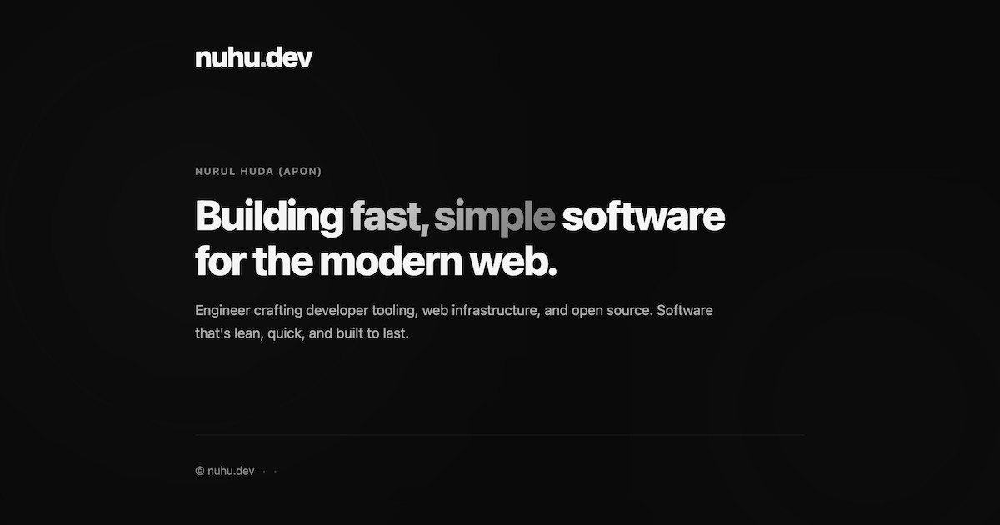

<div style="margin:0;overflow:hidden;border-radius:20px;height:360px;">
    
</div>

<p></p>
<p align="center">
	<a href="/">Website</a> ·
	<a href="/labs">Labs</a> ·
	<a href="/oss">OSS</a> ·
	<a href="mailto:info@nuhu.dev">Get in touch →</a>
</p>

## Developing
Requirements: `zig` (0.16.0)

Start dev server (http://localhost:3000):
```bash
zig build dev
```

Build static site (output in `dist/`):

```bash
zig build --release=small
zig build zx -- export
```
Built with

- Ziex: https://ziex.dev
- Zig: https://ziglang.org
